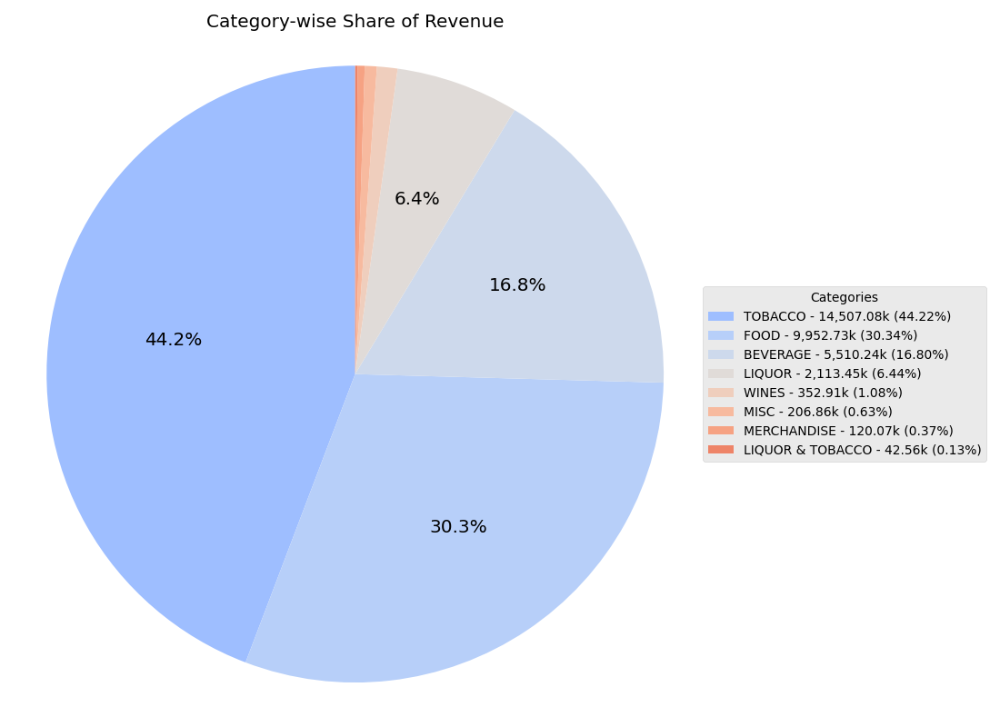
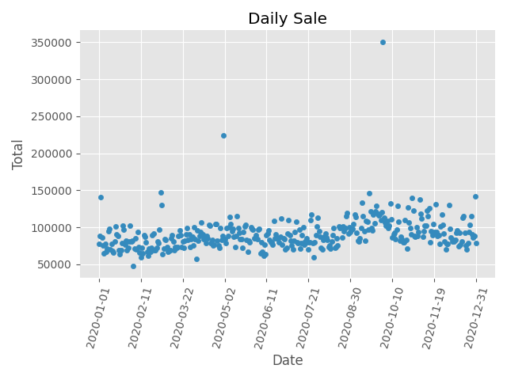
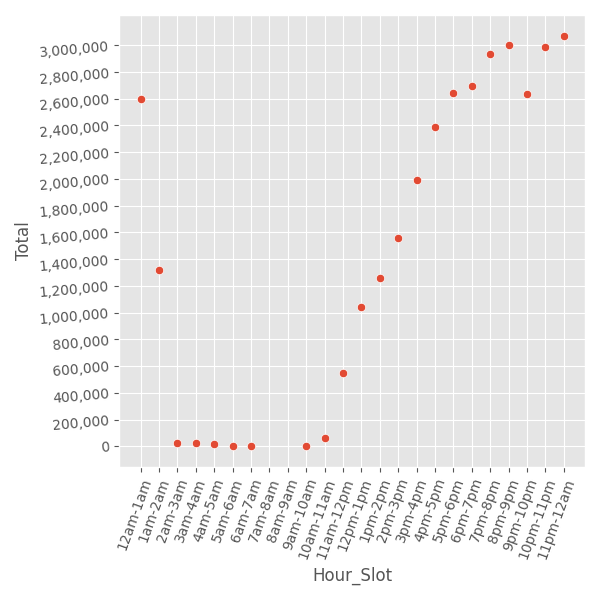
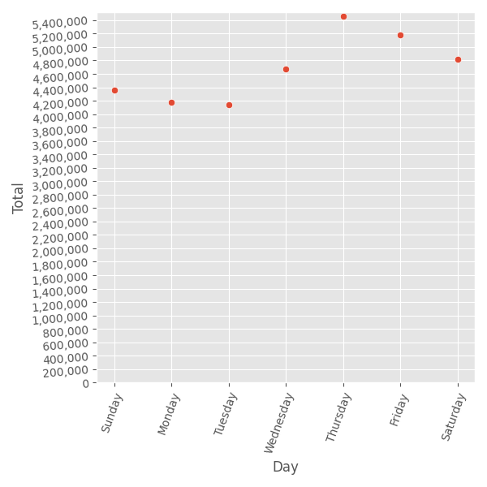
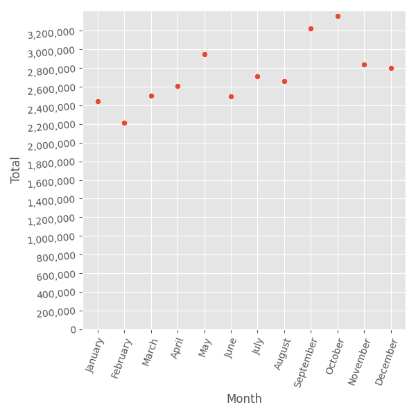
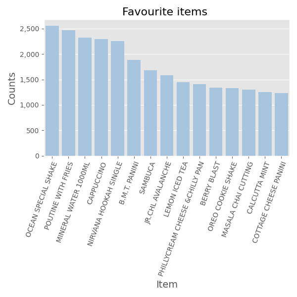

### This Demo serve to showcase my skill and experience with a sample of the Exploratory Data Analysis 
#### ( no code with be shown here and will show if requested )

---

this dataset is source from [Kaggle](https://www.kaggle.com/datasets/gladinvarghese/cafeocean), the orignal file is an excel with randomly generated data (will explain later in the demo)

## Step to perform

---

- Load the data as a dataframe for ease of use and correct the column names if required
> not related to a result
- Include insights about the most famous item overall and in each category [link to analysis](#finding-the-most-famous-item)
```
Category
BEVERAGE                        CAPPUCCINO
FOOD                   OCEAN SPECIAL SHAKE
LIQUOR                           CARLSBERG
LIQUOR & TOBACCO               BEER HOOKAH
MERCHANDISE         OCEAN SPECIAL T-SHIRTS
MISC                              ADD ON S
TOBACCO              NIRVANA HOOKAH SINGLE
WINES                   VLN CAB SAUV (GLS)
```
- Find the costliest item overall and in each category Finding the costliest item by category
```
                                                 costliest
Category         Item Desc                                
BEVERAGE         5 RED BULL                         450.00
FOOD             J.PCHENET SPARKLING ROSE (BTL)   1,700.00
LIQUOR           STELLA 1LTR 2+1                  1,300.00
LIQUOR & TOBACCO 4 DOM BEER + 1SPL SHEESHA          750.00
MERCHANDISE      FLAVOR 1000 GMS                  1,470.00
MISC             HOEGAARDEN LTR MUGS (2+1)        1,300.00
TOBACCO          LATE HARVEST SULA CHENIN (BTL)     500.00
WINES            GOSSIPS CHARD AUS (BTL)          2,100.00
```
- Create plots to explore category-wise share of revenue
> 
- Describe the day-wise sales trends
> [link to analysis](#finding-day-wise-sales-trend)
- Describe customer traffic in monthly, daily, and hourly granularity
> [link to analysis](#finding-traffic-trend)
- Perform menu analysis to come up with the combo the customers will like the most
> [link to analysis](#finding-menu-analysis)

<br>

## The work

---

So first we will change it into an easier format while checking the data

> This is the table preview from the xlsx file

| Date     | Bill Number  | Item Desc                | Time       | Quantity | Rate | Tax   | Discount | Total  | Category |
|----------|--------------|--------------------------|------------|----------|------|-------|----------|--------|----------|
| 1-Jan-20 | G0470115     | MINERAL WATER(1000ML)    | 1:15:11 PM | 1        | 50   | 11.88 | 0        | 61.88  | BEVERAGE |
| 1-Jan-20 | G0470115     | MONSOON MALABAR (AULAIT) | 1:15:11 PM | 1        | 100  | 23.75 | 0        | 123.75 | BEVERAGE |
| 1-Jan-20 | G0470116     | MASALA CHAI CUTTING      | 1:17:35 PM | 1        | 40   | 9.5   | 0        | 49.5   | BEVERAGE |


I'll use pandas here to read the excel and get an idea of the full data, here is what i got

Here we can see the same data from the preview above
```
Date            Bill Number              Item Desc     Time     Quantity     Rate     Tax  Discount    Total  Category
0 2020-01-01     G0470115     MINERAL WATER(1000ML)  13:15:11         1  50.0000 11.8800    0.0000  61.8800  BEVERAGE
1 2020-01-01     G0470115  MONSOON MALABAR (AULAIT)  13:15:11         1 100.0000 23.7500    0.0000 123.7500  BEVERAGE
2 2020-01-01     G0470116       MASALA CHAI CUTTING  13:17:35         1  40.0000  9.5000    0.0000  49.5000  BEVERAGE
```

<br>

Next, we can see there is a total of 145,830 (excluding header), 
every column is filled with data which is a good thing for me to show
here.

The data also load it in the right dtype so i won't be doing much on
the type transformation.
```
<class 'pandas.core.frame.DataFrame'>
RangeIndex: 145830 entries, 0 to 145829
Data columns (total 10 columns):
 #   Column        Non-Null Count   Dtype         
---  ------        --------------   -----         
 0   Date          145830 non-null  datetime64[ns]
 1   Bill Number   145830 non-null  object        
 2   Item Desc     145830 non-null  object        
 3   Time          145830 non-null  object        
 4   Quantity      145830 non-null  int64         
 5   Rate          145830 non-null  float64       
 6   Tax           145830 non-null  float64       
 7   Discount      145830 non-null  float64       
 8   Total         145830 non-null  float64       
 9   Category      145830 non-null  object        
dtypes: datetime64[ns](1), float64(4), int64(1), object(4)
memory usage: 11.1+ MB
```

<br>


Next, what i usually do is to check the number of unique data in the column.

Most column doesn't make sense here, but here we can see there are 9 Category and 579 unique Item, let's look at the Category 
```
Date              361
Bill Number     69982
Item Desc         579
Time            36200
Quantity           20
Rate              134
Tax               445
Discount          111
Total             470
Category            9
```

<br>

From the category, we already found some typo, I'll fix that before exporting the data for further analysis
```
[Before]
['BEVERAGE' 'FOOD' 'LIQUOR' 'MERCHANDISE' 'TOBACCO' 'MISC' 'WINES'
'LIQUOR & TPBACCO' 'LIQUOR ']

[After]
['BEVERAGE' 'FOOD' 'LIQUOR' 'MERCHANDISE' 'TOBACCO' 'MISC' 'WINES'
'LIQUOR & TOBACCO']

[Changes]
'LIQUOR ' > 'LIQUOR' # fixed whitespace at the end
'LIQUOR & TPBACCO' > 'LIQUOR & TOBACCO' # typo on TPBACCO
```

But wait, why do we have **'LIQUOR'**, **'TOBACCO'** and **'LIQUOR & TOBACCO'**

I've checked the category and the data clearly categories the item

```
LIQUOR

'CARLSBERG'
'TUBORG'
'1+1 KF 1 LITER'
'1+1 KF 1/2 LITER'
'KF DRAUGHT (1/2LTR)'
'KF DRAUGHT (1LTR)'
'STELLA ARTOIS (GLS)'
'HOEGAARDEN MUG (1 LITRE)'
'KF DRAUGHT PITCHER (2LTR)'
'1+1 KF 2 LITER'
'BEER TANK 3.5 LITRE'
'STELLA ARTOIS MUG (1 LTR)'
'STELLA ARTOIS MUG (1/2 LTR)'
'HOEGAARDEN (GLS)'
'HOEGAARDEN MUG (1/2 LITRE)'
'CARLSBERG 2+1'
'BUDWEISER'
'SCHNEIDER BUCKET - 6'
'BROOKLYN BUCKET - 4'
'BROOKLYN'
'SCHNEIDER WEISSE'
'STELLA 1LTR 2+1'
'STELLA ARTOIS'
'TEQUILA'
'TUBORG 2+1'
'UNLIMITED BEER'
'VODKA (SM)'
'WHISKEY (SM)'
'WHITE RUM (SM)'
'WHITE SANGRIA (CARAFE)áááááááá'
'WHITE SANGRIA (GLS)áááá áááááá'
'ZINZI RED (GLS)'
'ZINZI WHITE (GLS)'
'ZINZI WHITE (BTL)'
```

```
TOBACCO

'MINT FLAVOUR SINGLE'
'NIRVANA HOOKAH SINGLE'
'RED WINE SHEESHA'
'RABAT HOOKAH SINGLE'
'SAMBUCA'
'N R G HOOKAH'
'CALCUTTA MINT'
'SILVER APPLE SINGLE'
'GREEN APPLE FLAVOUR SINGLE'
'MISCHIEF HOOKAH SINGLE'
'GRAPE FLAVOUR SINGLE'
'BLUE BERRY SINGLE'
'THE CHAMPAGNE SHEESHA'
'AL SIKANDARI HOOKAH SINGLE'
'APPLE FLAVOUR SINGLE'
'WHITE WINE SHEESHA'
'JUICE HOOKAH SINGLE'
'CLASSIC MILD'
'STRAWBERRY FLAVOUR SINGLE'
'LEMON FLAVOUR SINGLE'
'LATE HARVEST SULA CHENIN (BTL)'
'PEACH FLAVOUR SINGLE'
'MARRAKESH HOOKAH SINGLE'
'CHERRY FLAVOUR SINGLE'
'BENSON & HEDGES LIGHTS'
'ORANGE FLAVOUR SINGLE'
'CLASSIC MENTHOL'
'AL SIKANDARI HOOKAH DOUBLE'
'APPLE FLAVOUR DOUBLE'
'APRICOT FLAVOUR SINGLE'
'ARABIAN MIST'
'CASABLANKA HOOKAH SINGLE'
'GOLD FLAKE KING RED'
'GOLD FLAKE KING BLUE'
'BENSON & HEDGES SPL'
'LATE HARVEST SULA CHENIN (GLS)'
'CLASSIC MENTHOL RUSH'
'CLASSIC ULTRA MILD'
'SPICE SHEESHA'
'BENSON & HEGDES GOLD BLUE'
'BLUE LAGOON SHEESHA'
'GOLD FLAKE KINGS-BIG'
'GOLD FLAKE LIGHTS-BIG'
'GOLD FLAKE ULTRA LIGHTS(20)'
'OCEAN SPECIAL HOOKAH SINGLE'
'ICE SPICE SHEESHA'
'CLASSIC REGULAR'
'MINT FLAVOUR DOUBLE'
'MIXED FLAVOUR SINGLE'
'INDIA KINGS OCEAN BLUE'
'REDBULL HOOKAH + 2REDBULL'
'VALENTINE SPECIAL SHEESHA'
```

```
'LIQUOR & TOBACCO'

'BEER HOOKAH'
'2 DOM BEER + 1SPL SHEESHA'
'4 DOM BEER + 1SPL SHEESHA'
'2 DOM BEER + 1PREM SHEESHA'
```
One of the task is to get the most famous item in each category so I will not consolidate the category as this that may skew the result of the analysis


> Depending on the request, I will also do a separate report that is more granula on the item itself

Now that I have cleaned and prepared the data, let's start the analysis


<br>


### Finding the most famous item

---
Now we will get the most famous item overall and in each category

To keep this demo short, here is the top 3 from each Category
```
BEVERAGE
- By Sales
CAPPUCCINO                          550,251.99   5495
RED BULL 2+1                        378,632.29   1166
RED BULL ENERGY DRINK               373,016.12   1860
- By Quantity
CAPPUCCINO                          5495   550,251.99
MINERAL WATER(1000ML)               3331   224,695.81
MOROCCAN MINT TEA                   2257   159,743.50

FOOD
- By Sales
OCEAN SPECIAL SHAKE              843,122.11   4895
JR.CHL AVALANCHE                 713,565.60   3314
POUTINE WITH FRIES               580,284.11   3464
- By Quantity
OCEAN SPECIAL SHAKE              4895   843,122.11
POUTINE WITH FRIES               3464   580,284.11
JR.CHL AVALANCHE                 3314   713,565.60

LIQUOR
- By Sales
CARLSBERG                        538,802.08   1716
TUBORG                           381,051.73   1473
KF DRAUGHT PITCHER (2LTR)        330,617.67    469
- By Quantity
CARLSBERG                        1716   538,802.08
TUBORG                           1473   381,051.73
KF DRAUGHT (1/2LTR)              1115   251,396.88

MERCHANDISE
- By Sales
OCEAN SPECIAL T-SHIRTS            13,351.80     34
SANDASS                            9,844.88     16
FLAVOUR 500 GMS                    6,378.75      7
- By Quantity
OCEAN SPECIAL T-SHIRTS             34    13,351.80
CH NOTE BOOKS                      28     2,187.15
CH TINS                            25     5,842.20

TOBACCO
- By Sales
NIRVANA HOOKAH SINGLE          2,953,134.60   8553
SAMBUCA                        2,291,058.00   4425
MINT FLAVOUR SINGLE            1,840,501.00   5817
- By Quantity
NIRVANA HOOKAH SINGLE            8553 2,953,134.60
MINT FLAVOUR SINGLE              5817 1,840,501.00
SAMBUCA                          4425 2,291,058.00

MISC
- By Sales
RED BULL SHEESHA                  61,182.00     91
PLAIN JANE (CHOCOLATE)            22,520.37    159
PARTY CHARGES @ 500/-             14,231.25      1

- By Quantity
ADD ON S                          379     8,469.93
PLAIN JANE (CHOCOLATE)            159    22,520.37
ADD HERB ROAST CHICKEN            158     6,670.13

WINES
- By Sales
VLN CAB SAUV (GLS)                47,625.90    146
RED SANGRIA (CARAFE) áááááááá     27,846.00     23
SULA BLUSH ZINFANDEL(GLS)         26,964.00     72

- By Quantity
VLN CAB SAUV (GLS)                146    47,625.90
RED SANGRIA (GLS)á áááááááááá      79    24,475.50
SULA BLUSH ZINFANDEL(GLS)          72    26,964.00

LIQUOR & TOBACCO
- By Sales
BEER HOOKAH                   32,324.00     40
2 DOM BEER + 1SPL SHEESHA      6,562.50     10
4 DOM BEER + 1SPL SHEESHA      1,968.76      2

- By Quantity
BEER HOOKAH                    40    32,324.00
2 DOM BEER + 1SPL SHEESHA      10     6,562.50
2 DOM BEER + 1PREM SHEESHA      2     1,706.26


```


and the highest selling item 
```
NIRVANA HOOKAH SINGLE             2,953,134.60   8553
```


<br>


### Finding the costliest item by category

---
Now we will get the costliest item in each category

```
                                                 costliest
Category         Item Desc                                
BEVERAGE         5 RED BULL                         450.00
FOOD             J.PCHENET SPARKLING ROSE (BTL)   1,700.00
LIQUOR           STELLA 1LTR 2+1                  1,300.00
LIQUOR & TOBACCO 4 DOM BEER + 1SPL SHEESHA          750.00
MERCHANDISE      FLAVOR 1000 GMS                  1,470.00
MISC             HOEGAARDEN LTR MUGS (2+1)        1,300.00
TOBACCO          LATE HARVEST SULA CHENIN (BTL)     500.00
WINES            GOSSIPS CHARD AUS (BTL)          2,100.00
```

<br>

### Finding day wise sales trend

---
Here we can see the breakdown from dod mean, standard deviation, min, max etc.
```
count       361.00
mean     90,875.06
std      22,805.22
min      47,176.66
25%      78,597.83
50%      87,203.94
75%      99,215.15
max     350,968.53
```


```
      Date      Total
2020-05-01 223,828.52
2020-10-01 350,968.53
```

<br>

### Finding traffic trend

---
```
monthly_traffic:
Month
January      11170
February     10063
March        11544
April        12216
May          13853
June         11500
July         12080
August       11654
September    14150
October      14145
November     11850
December     11605

daily_traffic:
Day
Sunday       19426
Monday       18755
Tuesday      18411
Wednesday    20736
Thursday     24185
Friday       23004
Saturday     21313

hourly_traffic:
Hour_Slot
12am-1am     10658
1am-2am       5295
2am-3am         77
3am-4am         64
4am-5am         54
5am-6am         18
6am-7am          1
9am-10am        10
10am-11am      438
11am-12pm     2927
12pm-1pm      4947
1pm-2pm       6061
2pm-3pm       7380
3pm-4pm       9125
4pm-5pm      10530
5pm-6pm      11745
6pm-7pm      12218
7pm-8pm      13559
8pm-9pm      13785
9pm-10pm     11618
```





<br>

### Finding Menu Analysis
First we group the date time and get the pairs made on the same receipt (same time)

```
          Date_Time                                                                                                                Items
2020-01-01 00:08:20            COUNTRY LEMONADE, B.M.T. PANINI, B.M.T. PANINI, KIT KAT SHAKE, OCEAN SPECIAL SHAKE, LINDT CHOCOLATE SHAKE
2020-01-01 00:15:47                                                                    GREEN APPLE FLAVOUR SINGLE, NIRVANA HOOKAH SINGLE
2020-01-01 00:24:01  LEMON ICED TEA, COTTAGE CHEESE PANINI, GARDEN FRESH PANINI, POUTINE WITH FRIES, GOOEY CHOCOLATE FUDGE, N R G HOOKAH
2020-01-01 00:32:51                                              HOUSEBLEND FULLCITY (AU LAIT), OCEAN SPECIAL SHAKE, BAILEYS IRISH SHAKE
2020-01-01 00:47:00                                                                                             JR.CHL AVALANCHE, TUBORG
```

then we filter the unique groups and count the items (so that 'item A & item B' and 'item B & item A' will be consider
as 1 group instead of 2 different group)


---
